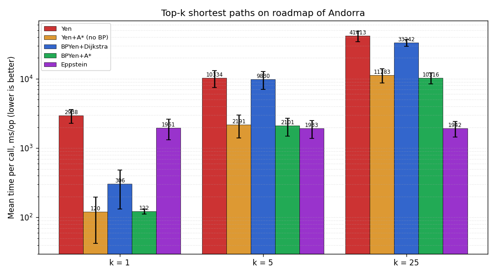
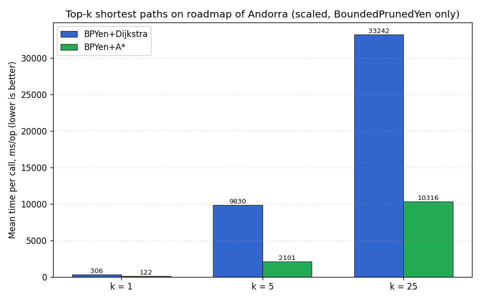
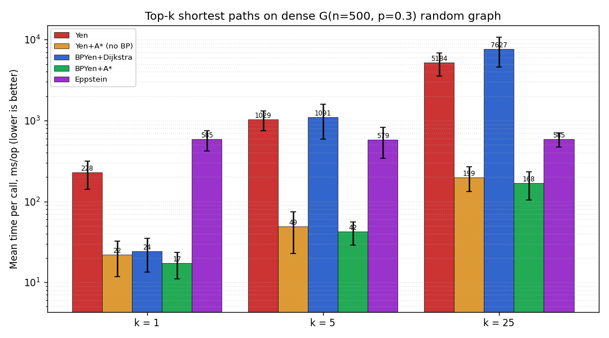
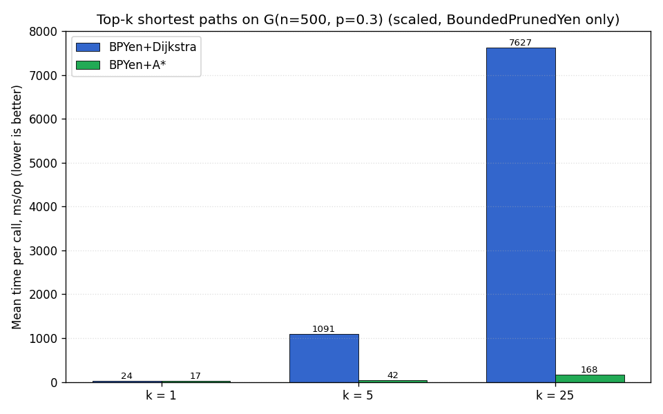

<!--
  Draft replacement for the wiki page
      https://github.com/jgrapht/jgrapht/wiki/Demos%3A-ShortestPathDemo
  Lives under docs/wiki/ on the seilat/jgrapht maintenance branch and is NOT
  published; the maintainers copy the rendered content into the wiki repo
  (jgrapht/jgrapht.wiki.git).
-->
This is a high-level comparison of the available shortest path algorithms in the JGraphT library.

# Introduction

The `ShortestPathAlgorithm` interface consists of the following 3 methods:

```java
public interface ShortestPathAlgorithm<V, E>{
    
    /**
     *  Computes shortest paths between source and sink vertices.
     */
    GraphPath<V, E> getPath(V source, V sink);
    
    /**
     * Computes weight of the shortest path between source and sink vertices.
     */
    double getPathWeight(V source, V sink);
    
    /**
     * Computes shortest paths tree routed at source vertex.
     */
    SingleSourcePaths<V, E> getPaths(V source);
}
```

There is a sub-interface `ManyToManyShortestPathsAlgorithm` for the case when 
it is needed to find the shortest path between every source `s` from a set of vertices `S` 
to every target `t` from a set of vertices `T`. The `ManyToManyShortestPathsAlgorithm` 
interface adds 1 method to the `ShortestPathAlgorithm` interface:

```java
public interface ManyToManyShortestPathsAlgorithm<V, E>
    extends
    ShortestPathAlgorithm<V, E> {

    /**
     * Computes shortest paths from all vertices in sources to all vertices in
     * targets.
     */
    ManyToManyShortestPaths<V, E> getManyToManyPaths(Set<V> sources, Set<V> targets);
} 
```

For top-*k* shortest simple paths there is the related `KShortestPathAlgorithm`
interface:

```java
public interface KShortestPathAlgorithm<V, E> {

    /**
     * Computes the k shortest simple paths from source to sink, in
     * non-decreasing weight order.
     */
    List<GraphPath<V, E>> getPaths(V source, V sink, int k);
}
```

The inheritance tree of the `ShortestPathAlgorithm` interface looks the following way:


All available shortest paths algorithms can be divided into the following non-disjoint groups.

* Algorithms, which solve the single source single destination problem and 
provide a non-default implementation of the `getPath()` method.

    - `DijkstraShortestPath`
    - `IntVertexDijkstraShortestPath`
    - `BFSShortestPath`
    - `DeltaSteppingShortestPaths`

* Algorithms, which solve the single-source all destinations problem and 
provide a non-default implementation of the `getPaths()` method.
    
    - `DijkstraShortestPath`
    - `IntVertexDijkstraShortestPath`
    - `AStarShortestPath`
    - `BellmanFordShortestPath`   
    - `BidirectionalDijkstraShortestPath`
    - `BidirectionalAStarShortestPath`
    - `ContractionHierarchyBidirectionalDijkstra`
    - `TransitNodeRoutingShortestPath`

* Algorithms, which solve the all-pairs shortest path problem.

    - `JohnsonShortestPaths`
    - `FloydWarshallShortestPaths`

* Algorithms, which solve the many-to-many shortest path problem. 
    
    - `DefaultManyToManyShortestPath`
    - `DijkstraManyToManyShortestPath`
    - `CHManyToManyShortestPath`

* Algorithms, which solve the top-*k* shortest simple path problem.

    - `YenKShortestPath`
    - `EppsteinKShortestPath`
    - `BoundedPrunedYenKShortestPath`
    
* Additionally, there are a number of auxiliary pre-computation algorithms which are
used to speed up shortest path computations.

    - `ALTAdmissibleHeuristics`
    - `ContractionHierarchyPrecomputation`
    - `TransitNodeRoutingPrecomputation`

# Use cases

The efficiency of some algorithms listed above depends on the type of graph they are used on.
Generally, the following guidelines apply:

1. The `DeltaSteppingShortestPath` is designed to operate on random or nearly-complete graphs.
The algorithm outperforms the `DijkstraShortestPath` and `BellmanFordShortestPath` on graphs 
generated by such random graphs generators, as `GnpRandomGraphGenerator`, `GnmRandomGraphGenerator`,
`BarabasiAlbertGraphGenerator`, etc. Performance of the `DeltaSteppingShortestPath` is 
demonstrated by the `DeltaSteppingShortestPathPerformance` benchmark class.

1. `ContractionHierarchyPrecomputation` implements [contraction hierarchy algorithm](https://en.wikipedia.org/wiki/Contraction_hierarchies).
It shows the best performance on sparse graphs with low average out-degree of vertices. 
Its ideal use case scenario are graphs which represent real-world roadmaps. 
Therefore, the following algorithms are also limited to the type of graphs:
    
    
    - ContractionHierarchyBidirectionalDijkstra
    - TransitNodeRoutingShortestPath
    - CHManyToManyShortestPath 

1. For top-*k* shortest simple paths, `BoundedPrunedYenKShortestPath` accepts
a pluggable `SpurShortestPathEngine` back-end. The default `DijkstraSpurEngine`
mirrors classical `YenKShortestPath`; passing an `AStarSpurEngine` uses a
reverse-distance heuristic that is admissible by construction, which is the
preferred choice on roadmaps and other sparse graphs.

1. Finally, every algorithm has a different performance. That is why this demo
also provides a number of benchmark results for random graphs as well as a roadmap.
Note, that those results might be different for other graph types. 

# Demo

The next chunk of code demonstrates a completed usage example for the following algorithms.

    - BidirectionalAStartShortestPath
    - ContractionHierarchyBidirectionalDijkstra
    - TransitNodeRoutingShortestPath
    - CHManyToManyShortestPaths
    - BoundedPrunedYenKShortestPath

```java
import org.jgrapht.Graph;
import org.jgrapht.GraphPath;
import org.jgrapht.alg.interfaces.AStarAdmissibleHeuristic;
import org.jgrapht.alg.interfaces.ManyToManyShortestPathsAlgorithm;
import org.jgrapht.alg.interfaces.ShortestPathAlgorithm;
import org.jgrapht.alg.shortestpath.AStarSpurEngine;
import org.jgrapht.alg.shortestpath.BoundedPrunedYenKShortestPath;
import org.jgrapht.generate.GnpRandomGraphGenerator;
import org.jgrapht.graph.DefaultWeightedEdge;
import org.jgrapht.graph.DirectedWeightedMultigraph;
import org.jgrapht.util.CollectionUtil;
import org.jgrapht.util.SupplierUtil;

import java.util.Collections;
import java.util.List;
import java.util.Random;
import java.util.Set;

import static org.jgrapht.alg.interfaces.ManyToManyShortestPathsAlgorithm.ManyToManyShortestPaths;
import static org.jgrapht.alg.shortestpath.ContractionHierarchyPrecomputation.ContractionHierarchy;

public class ShortestPathDemo {
    private static final long SEED = 19l;
    private static Random rnd = new Random(SEED);
    private static int numberOfLandmarks = 2;

    public static void main(String[] args) {
        Graph<Integer, DefaultWeightedEdge> graph = generateGraph();

        Set<Integer> landmarks = selectRandomLandmarks(graph, numberOfLandmarks);

        // create heuristic for the algorithm
        AStarAdmissibleHeuristic<Integer> heuristic = new ALTAdmissibleHeuristic<>(graph, landmarks);
        ShortestPathAlgorithm<Integer, DefaultWeightedEdge> shortestPath
                = new BidirectionalAStarShortestPath<>(graph, heuristic);
        System.out.println("Shortest path between vertices 1 and 4:");
        System.out.println(shortestPath.getPath(1, 4));

        ContractionHierarchyPrecomputation<Integer, DefaultWeightedEdge> precomputation
                = new ContractionHierarchyPrecomputation<>(graph);
        ContractionHierarchy<Integer, DefaultWeightedEdge> hierarchy
                = precomputation.computeContractionHierarchy();

        ShortestPathAlgorithm<Integer, DefaultWeightedEdge> chDijkstra
                = new ContractionHierarchyBidirectionalDijkstra<>(hierarchy);
        System.out.println("Shortest path computed by ContractionHierarchyBidirectionalDijkstra between vertices 1 and 4:");
        System.out.println(chDijkstra.getPath(1, 4));

        TransitNodeRoutingShortestPath<Integer, DefaultWeightedEdge> tnr = new TransitNodeRoutingShortestPath<>(graph);
        System.out.println("Shortest path computed by TransitNodeRoutingShortestPath between vertices 1 and 4:");
        System.out.println(tnr.getPath(1, 4));

        // it is possible to supply an already computed hierarchy to the CHManyToManyShortestPaths algorithm
        ManyToManyShortestPathsAlgorithm<Integer, DefaultWeightedEdge> chManyToMany
                = new CHManyToManyShortestPaths<>(hierarchy);
        ManyToManyShortestPaths<Integer, DefaultWeightedEdge> manyToManyShortestPaths
                = chManyToMany.getManyToManyPaths(Collections.singleton(1), Collections.singleton(4));
        System.out.println("Shortest path computed by CHManyToManyShortestPaths between vertices 1 and 4:");
        System.out.println(manyToManyShortestPaths.getPath(1, 4));

        // top-k shortest simple paths with the A* spur engine
        BoundedPrunedYenKShortestPath<Integer, DefaultWeightedEdge> bpYen
                = new BoundedPrunedYenKShortestPath<>(graph, new AStarSpurEngine<>());
        List<GraphPath<Integer, DefaultWeightedEdge>> top5 = bpYen.getPaths(1, 4, 5);
        System.out.println("Top-5 shortest paths from 1 to 4 (BoundedPrunedYenKShortestPath):");
        top5.forEach(System.out::println);
    }

    /**
     * Selects random landmark vertices from the provided graph
     *
     * @param graph             a graph
     * @param numberOfLandmarks needed number of vertices
     * @return set of landmarks
     */
    private static Set<Integer> selectRandomLandmarks(Graph<Integer, DefaultWeightedEdge> graph, int numberOfLandmarks) {
        Object[] vertices = graph.vertexSet().toArray();

        Set<Integer> result = CollectionUtil.newHashSetWithExpectedSize(numberOfLandmarks);
        while (result.size() < numberOfLandmarks) {
            int position = rnd.nextInt(vertices.length);
            Integer vertex = (Integer) vertices[position];
            result.add(vertex);
        }

        return result;
    }

    /**
     * Generates G(n,p) random graph with 10 vertices and edge probability of 0.5.
     *
     * @return generated graph.
     */
    private static Graph<Integer, DefaultWeightedEdge> generateGraph() {
        DirectedWeightedMultigraph<Integer, DefaultWeightedEdge> graph
                = new DirectedWeightedMultigraph<>(DefaultWeightedEdge.class);
        graph.setVertexSupplier(SupplierUtil.createIntegerSupplier());

        GnpRandomGraphGenerator<Integer, DefaultWeightedEdge> generator
                = new GnpRandomGraphGenerator<>(20, 0.5);
        generator.generateGraph(graph);

        for (DefaultWeightedEdge edge : graph.edgeSet()) {
            graph.setEdgeWeight(edge, rnd.nextDouble());
        }
        return graph;
    }
}
```


# Benchmarks

Performance evaluation was conducted on a machine running Ubuntu 
18.04 LTS equipped with 16GB of DDR4/2 RAM and Intel Core i7-8750H 
CPU which has 6 cores and supports up to 12 threads.

Several notes about the benchmarking process:
    
1. Two types of graphs were used: 
    - [G(n, p)](https://en.wikipedia.org/wiki/Erd%C5%91s%E2%80%93R%C3%A9nyi_model) 
    random graphs with n = 250 and p = 0.5. 
    - Roadmap of Andorra which is available as part of the [OSM project](https://download.geofabrik.de/).
         
1. Unlike other algorithms, BFSShortestPath is tested on unweighted random graphs.

1. ContractionHierarchyBidirectionalDijkstra and TransitNodeRoutingShortestPath are
tested only on roadmaps since they use Contraction Hierarchy pre-computation step 
which has good performance only for sparse graphs with low average out-degree of vertices.

1. Many-to-many algorithms are tested only on roadmap of Andorra since CHManyToManyShortestPath
uses Contraction Hierarchy pre-computation.  

1. Algorithms based on A* search use 2 following types of heuristics for random graphs: 
    
    - no heuristic which always returns 0.0 for the distance estimate
    - ALT heuristic with 4 landmarks. 

1. Algorithms based on A* search use 3 following heuristics on the roadmap of Andorra: 
    
    - no heuristic which always returns 0.0 for the distance estimate
    - the [great-circle distance](https://en.wikipedia.org/wiki/Great-circle_distance#:~:text=The%20great%2Dcircle%20distance%20or,line%20through%20the%20sphere's%20interior) (GC).
    - ALT heuristic with 8 landmarks. 

1. For some plots, there is a scaled version to show too small or indistinguishable values.

1. Benchmarks for the many-to-many the shortest paths algorithms use a constant number
of source vertices (100) and a variable number of targets.

1. Top-*k* shortest path benchmarks sweep over `k` on two graph families &mdash;
the Andorra roadmap above and a dense `G(n=500, p=0.3)` random graph &mdash; and
compare five variants: classical `YenKShortestPath`, `BoundedPrunedYenKShortestPath`
with `DijkstraSpurEngine` (bounded-prune layer only), the same with `AStarSpurEngine`
and `setBoundedPruning(false)` (A* spur engine only, no bounded prune),
`BoundedPrunedYenKShortestPath` with `AStarSpurEngine` (both), and
`EppsteinKShortestPath`. Yen-family variants all return the same ordered simple-path
sequence; Eppstein returns the *k* lowest-weight walks (loops allowed) and is included
for reference rather than direct comparison.

### Benchmark results for random graphs


### Benchmark results for roadmap of Andorra


### Benchmark results of many-to-many algorithms for roadmap of Andorra


### Benchmark results of pre-computation algorithms for roadmap of Andorra


### Benchmark results for top-*k* shortest paths on roadmap of Andorra





### Benchmark results for top-*k* shortest paths on dense G(n,p) random graphs




