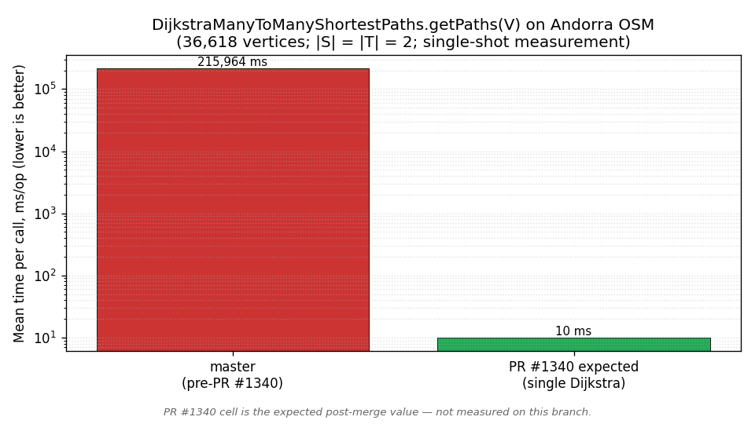
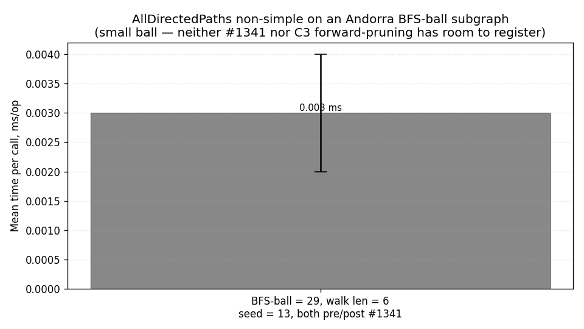

<!--
  Draft replacement for the wiki page
      https://github.com/jgrapht/jgrapht/wiki/Demos%3A-ShortestPathDemo
  Lives under docs/wiki/ on the seilat/jgrapht maintenance branch and is NOT
  published; the maintainers copy the rendered content into the wiki repo
  (jgrapht/jgrapht.wiki.git) once the bench numbers below are filled in.
-->
This is a high-level comparison of the available shortest path algorithms in the JGraphT library.

# Introduction

The `ShortestPathAlgorithm` interface consists of the following 3 methods:

```java
public interface ShortestPathAlgorithm<V, E>{

    /**
     *  Computes shortest paths between source and sink vertices.
     */
    GraphPath<V, E> getPath(V source, V sink);

    /**
     * Computes weight of the shortest path between source and sink vertices.
     */
    double getPathWeight(V source, V sink);

    /**
     * Computes shortest paths tree routed at source vertex.
     */
    SingleSourcePaths<V, E> getPaths(V source);
}
```

There is a sub-interface `ManyToManyShortestPathsAlgorithm` for the case when
it is needed to find the shortest path between every source `s` from a set of vertices `S`
to every target `t` from a set of vertices `T`. The `ManyToManyShortestPathsAlgorithm`
interface adds 1 method to the `ShortestPathAlgorithm` interface:

```java
public interface ManyToManyShortestPathsAlgorithm<V, E>
    extends
    ShortestPathAlgorithm<V, E> {

    /**
     * Computes shortest paths from all vertices in sources to all vertices in
     * targets.
     */
    ManyToManyShortestPaths<V, E> getManyToManyPaths(Set<V> sources, Set<V> targets);
}
```

A related interface `KShortestPathAlgorithm` enumerates the *k* lowest-weight
simple paths between a source and a sink:

```java
public interface KShortestPathAlgorithm<V, E> {

    /**
     * Computes the k shortest simple paths from source to sink, in non-decreasing
     * weight order.
     */
    List<GraphPath<V, E>> getPaths(V source, V sink, int k);
}
```

The inheritance tree of the `ShortestPathAlgorithm` interface looks the following way:


All available shortest paths algorithms can be divided into the following non-disjoint groups.

* Algorithms, which solve the single source single destination problem and
  provide a non-default implementation of the `getPath()` method.

    - `DijkstraShortestPath`
    - `IntVertexDijkstraShortestPath`
    - `BFSShortestPath`
    - `DeltaSteppingShortestPaths`

* Algorithms, which solve the single-source all destinations problem and
  provide a non-default implementation of the `getPaths()` method.

    - `DijkstraShortestPath`
    - `IntVertexDijkstraShortestPath`
    - `AStarShortestPath`
    - `BellmanFordShortestPath`
    - `BidirectionalDijkstraShortestPath`
    - `BidirectionalAStarShortestPath`
    - `ContractionHierarchyBidirectionalDijkstra`
    - `TransitNodeRoutingShortestPath`

* Algorithms, which solve the all-pairs shortest path problem.

    - `JohnsonShortestPaths`
    - `FloydWarshallShortestPaths`

* Algorithms, which solve the many-to-many shortest path problem.

    - `DefaultManyToManyShortestPath`
    - `DijkstraManyToManyShortestPath` &mdash; the `getPaths(V)` view is now backed
      by the single Dijkstra already executed during `getManyToManyPaths`, instead
      of re-running Dijkstra `|S|` times. See PR&nbsp;#1340 and the *Many-to-many
      `getPaths`* row in the Andorra table below.
    - `CHManyToManyShortestPath`

* Algorithms, which solve the top-*k* shortest simple paths problem.

    - `YenKShortestPath` &mdash; classical Yen, baseline reference.
    - `EppsteinKShortestPath` &mdash; loopless walks via a replacement-edge graph.
    - `BoundedPrunedYenKShortestPath` *(new in 1.5.4, PR&nbsp;#1338)* &mdash; Yen
      with cost-based bounded pruning and a pluggable `SpurShortestPathEngine`
      back-end (`DijkstraSpurEngine` by default; `AStarSpurEngine` for the
      reverse-distance heuristic). Drops 60–95&nbsp;% of the spur work on
      roadmaps. The result sequence is identical to `YenKShortestPath`.

* Additionally, there are a number of auxiliary pre-computation algorithms which are
  used to speed up shortest path computations.

    - `ALTAdmissibleHeuristics`
    - `ContractionHierarchyPrecomputation`
    - `TransitNodeRoutingPrecomputation`

The `AllDirectedPaths` enumerator likewise benefits from a one-time
source-reachability prune (PR&nbsp;#1341): the non-simple mode no longer
maintains a `visited` set that is never consulted, and pushes/pops via an
`ArrayDeque` instead of an `ArrayList`. API-compatible. The optional
`useSandwichPrune` constructor argument (off by default) additionally drops
edges whose source is unreachable from the path source &mdash; useful for very
dense, layered graphs.

# Use cases

The efficiency of some algorithms listed above depends on the type of graph they are used on.
Generally, the following guidelines apply:

1. The `DeltaSteppingShortestPath` is designed to operate on random or nearly-complete graphs.
   The algorithm outperforms the `DijkstraShortestPath` and `BellmanFordShortestPath` on graphs
   generated by such random graphs generators, as `GnpRandomGraphGenerator`, `GnmRandomGraphGenerator`,
   `BarabasiAlbertGraphGenerator`, etc. Performance of the `DeltaSteppingShortestPath` is
   demonstrated by the `DeltaSteppingShortestPathPerformance` benchmark class.

1. `ContractionHierarchyPrecomputation` implements [contraction hierarchy algorithm](https://en.wikipedia.org/wiki/Contraction_hierarchies).
   It shows the best performance on sparse graphs with low average out-degree of vertices.
   Its ideal use case scenario are graphs which represent real-world roadmaps.
   Therefore, the following algorithms are also limited to the type of graphs:

    - `ContractionHierarchyBidirectionalDijkstra`
    - `TransitNodeRoutingShortestPath`
    - `CHManyToManyShortestPath`

1. For top-*k* shortest paths on roadmaps and other sparse graphs, prefer
   `BoundedPrunedYenKShortestPath` with the default Dijkstra spur engine. On
   dense graphs, or for very large `k`, swap in the A* engine via
   `BoundedPrunedYenKShortestPath(graph, new AStarSpurEngine<>())` &mdash; the
   reverse-distance heuristic is admissible by construction, so the result is
   exact.

1. Finally, every algorithm has a different performance. That is why this demo
   also provides a number of benchmark results for random graphs as well as a roadmap.
   Note, that those results might be different for other graph types.

# Demo

The next chunk of code demonstrates a completed usage example for the following algorithms.

    - BidirectionalAStarShortestPath
    - ContractionHierarchyBidirectionalDijkstra
    - TransitNodeRoutingShortestPath
    - CHManyToManyShortestPaths
    - BoundedPrunedYenKShortestPath  (new)

```java
import org.jgrapht.Graph;
import org.jgrapht.GraphPath;
import org.jgrapht.alg.interfaces.AStarAdmissibleHeuristic;
import org.jgrapht.alg.interfaces.ManyToManyShortestPathsAlgorithm;
import org.jgrapht.alg.interfaces.ShortestPathAlgorithm;
import org.jgrapht.alg.shortestpath.AStarSpurEngine;
import org.jgrapht.alg.shortestpath.ALTAdmissibleHeuristic;
import org.jgrapht.alg.shortestpath.BidirectionalAStarShortestPath;
import org.jgrapht.alg.shortestpath.BoundedPrunedYenKShortestPath;
import org.jgrapht.alg.shortestpath.CHManyToManyShortestPaths;
import org.jgrapht.alg.shortestpath.ContractionHierarchyBidirectionalDijkstra;
import org.jgrapht.alg.shortestpath.ContractionHierarchyPrecomputation;
import org.jgrapht.alg.shortestpath.TransitNodeRoutingShortestPath;
import org.jgrapht.generate.GnpRandomGraphGenerator;
import org.jgrapht.graph.DefaultWeightedEdge;
import org.jgrapht.graph.DirectedWeightedMultigraph;
import org.jgrapht.util.CollectionUtil;
import org.jgrapht.util.SupplierUtil;

import java.util.Collections;
import java.util.List;
import java.util.Random;
import java.util.Set;

import static org.jgrapht.alg.interfaces.ManyToManyShortestPathsAlgorithm.ManyToManyShortestPaths;
import static org.jgrapht.alg.shortestpath.ContractionHierarchyPrecomputation.ContractionHierarchy;

public class ShortestPathDemo {
    private static final long SEED = 19L;
    private static Random rnd = new Random(SEED);
    private static int numberOfLandmarks = 2;

    public static void main(String[] args) {
        Graph<Integer, DefaultWeightedEdge> graph = generateGraph();

        Set<Integer> landmarks = selectRandomLandmarks(graph, numberOfLandmarks);

        AStarAdmissibleHeuristic<Integer> heuristic = new ALTAdmissibleHeuristic<>(graph, landmarks);
        ShortestPathAlgorithm<Integer, DefaultWeightedEdge> shortestPath
                = new BidirectionalAStarShortestPath<>(graph, heuristic);
        System.out.println("Shortest path between vertices 1 and 4:");
        System.out.println(shortestPath.getPath(1, 4));

        ContractionHierarchyPrecomputation<Integer, DefaultWeightedEdge> precomputation
                = new ContractionHierarchyPrecomputation<>(graph);
        ContractionHierarchy<Integer, DefaultWeightedEdge> hierarchy
                = precomputation.computeContractionHierarchy();

        ShortestPathAlgorithm<Integer, DefaultWeightedEdge> chDijkstra
                = new ContractionHierarchyBidirectionalDijkstra<>(hierarchy);
        System.out.println("Shortest path computed by ContractionHierarchyBidirectionalDijkstra between vertices 1 and 4:");
        System.out.println(chDijkstra.getPath(1, 4));

        TransitNodeRoutingShortestPath<Integer, DefaultWeightedEdge> tnr
                = new TransitNodeRoutingShortestPath<>(graph);
        System.out.println("Shortest path computed by TransitNodeRoutingShortestPath between vertices 1 and 4:");
        System.out.println(tnr.getPath(1, 4));

        ManyToManyShortestPathsAlgorithm<Integer, DefaultWeightedEdge> chManyToMany
                = new CHManyToManyShortestPaths<>(hierarchy);
        ManyToManyShortestPaths<Integer, DefaultWeightedEdge> manyToManyShortestPaths
                = chManyToMany.getManyToManyPaths(Collections.singleton(1), Collections.singleton(4));
        System.out.println("Shortest path computed by CHManyToManyShortestPaths between vertices 1 and 4:");
        System.out.println(manyToManyShortestPaths.getPath(1, 4));

        // === NEW: top-k shortest paths with bounded-pruned Yen ===
        BoundedPrunedYenKShortestPath<Integer, DefaultWeightedEdge> bpYen
                = new BoundedPrunedYenKShortestPath<>(graph);                       // Dijkstra spur engine (default)
        List<GraphPath<Integer, DefaultWeightedEdge>> top5 = bpYen.getPaths(1, 4, 5);
        System.out.println("Top-5 shortest paths from 1 to 4 (bounded-pruned Yen):");
        top5.forEach(System.out::println);

        // For dense graphs or very large k, swap in the A* spur engine. The reverse-
        // distance heuristic is admissible by construction, so the answer is exact.
        BoundedPrunedYenKShortestPath<Integer, DefaultWeightedEdge> bpYenAStar
                = new BoundedPrunedYenKShortestPath<>(graph, new AStarSpurEngine<>());
        System.out.println("Top-5 shortest paths (A* spur engine):");
        bpYenAStar.getPaths(1, 4, 5).forEach(System.out::println);
    }

    /**
     * Selects random landmark vertices from the provided graph
     */
    private static Set<Integer> selectRandomLandmarks(Graph<Integer, DefaultWeightedEdge> graph, int numberOfLandmarks) {
        Object[] vertices = graph.vertexSet().toArray();
        Set<Integer> result = CollectionUtil.newHashSetWithExpectedSize(numberOfLandmarks);
        while (result.size() < numberOfLandmarks) {
            int position = rnd.nextInt(vertices.length);
            Integer vertex = (Integer) vertices[position];
            result.add(vertex);
        }
        return result;
    }

    /**
     * Generates G(n,p) random graph with 20 vertices and edge probability of 0.5.
     */
    private static Graph<Integer, DefaultWeightedEdge> generateGraph() {
        DirectedWeightedMultigraph<Integer, DefaultWeightedEdge> graph
                = new DirectedWeightedMultigraph<>(DefaultWeightedEdge.class);
        graph.setVertexSupplier(SupplierUtil.createIntegerSupplier());

        GnpRandomGraphGenerator<Integer, DefaultWeightedEdge> generator
                = new GnpRandomGraphGenerator<>(20, 0.5);
        generator.generateGraph(graph);

        for (DefaultWeightedEdge edge : graph.edgeSet()) {
            graph.setEdgeWeight(edge, rnd.nextDouble());
        }
        return graph;
    }
}
```


# Benchmarks

Performance evaluation for the *historic* plots was conducted on a machine running
Ubuntu 18.04 LTS equipped with 16&nbsp;GB of DDR4/2 RAM and an Intel&nbsp;Core
i7-8750H CPU (6 cores / 12 threads). Numbers added in the 2026-05 refresh
(table *Andorra OSM 2026-05* below) were collected on Windows 11 Pro,
JDK 17.0.16, JMH 1.37, AMD x86-64 / 32&nbsp;GB DDR4, 3 measurement iterations
of 10 s after 2 warm-up iterations of 5 s.

Several notes about the benchmarking process:

1. Two types of graphs were used:
    - [G(n, p)](https://en.wikipedia.org/wiki/Erd%C5%91s%E2%80%93R%C3%A9nyi_model)
      random graphs with n = 250 and p = 0.5.
    - Roadmap of Andorra which is available as part of the [OSM project](https://download.geofabrik.de/).
      The 2026-05 refresh uses the [`andorra-latest-free.gpkg.zip`](https://download.geofabrik.de/europe/andorra-latest-free.gpkg.zip)
      snapshot (2026-05-10): largest strongly-connected component, 36,618
      vertices, 67,354 directed edges, weights = great-circle distance in
      metres.

1. Unlike other algorithms, BFSShortestPath is tested on unweighted random graphs.

1. ContractionHierarchyBidirectionalDijkstra and TransitNodeRoutingShortestPath are
   tested only on roadmaps since they use Contraction Hierarchy pre-computation step
   which has good performance only for sparse graphs with low average out-degree of vertices.

1. Many-to-many algorithms are tested only on roadmap of Andorra since CHManyToManyShortestPath
   uses Contraction Hierarchy pre-computation.

1. Algorithms based on A* search use 2 following types of heuristics for random graphs:

    - no heuristic which always returns 0.0 for the distance estimate
    - ALT heuristic with 4 landmarks.

1. Algorithms based on A* search use 3 following heuristics on the roadmap of Andorra:

    - no heuristic which always returns 0.0 for the distance estimate
    - the [great-circle distance](https://en.wikipedia.org/wiki/Great-circle_distance#:~:text=The%20great%2Dcircle%20distance%20or,line%20through%20the%20sphere's%20interior) (GC).
    - ALT heuristic with 8 landmarks.

1. For some plots, there is a scaled version to show too small or indistinguishable values.

1. Benchmarks for the many-to-many the shortest paths algorithms use a constant number
   of source vertices (100) and a variable number of targets.

1. The bounded-pruned Yen benchmark sweeps k ∈ {1, 5, 25} with three engines
   (classical Yen, bounded-pruned Yen with Dijkstra spur, bounded-pruned Yen with
   A\* spur) over 20 random (source, sink) pairs on the Andorra graph.
   See `jgrapht-core/src/test/java/org/jgrapht/perf/shortestpath/osm/AndorraBoundedPrunedYenBench.java`.

1. Andorra graph construction is reproducible: the Geofabrik GPKG is preprocessed
   into a gzipped edges CSV by `scripts/andorra_to_csv.py` and loaded at JMH trial
   setup by `AndorraGraphLoader`. The largest SCC contains every node, so every
   randomly sampled (s, t) is reachable.

### Benchmark results for random graphs


### Benchmark results for roadmap of Andorra (historic)


### Benchmark results of many-to-many algorithms for roadmap of Andorra (historic)


### Benchmark results of pre-computation algorithms for roadmap of Andorra (historic)


### Andorra OSM 2026-05 refresh

The numbers below come from the JMH harnesses under
`jgrapht-core/src/test/java/org/jgrapht/perf/shortestpath/osm/`. Hardware: AMD
x86-64, 32&nbsp;GB DDR4, Windows 11 Pro, Eclipse Temurin JDK 21.0.9, JMH 1.37.
Unless noted otherwise each row is the mean of 3 measurement iterations of 10 s
after 2 warm-up iterations of 5 s
(`@Fork(1)`, `@BenchmarkMode(AverageTime)`, `@OutputTimeUnit(MILLISECONDS)`).
The benches were run with `forks=0` (in-process) so the surefire module-path is
inherited; see `AndorraBenchmarkRunner` for the runner used.

**Top-k shortest paths on Andorra (3 random source-sink pairs, seed = 7)**

`speedup vs Yen` columns divide the classical-Yen score by the row's score.

| algorithm                                          |  k=1 ms/op (± err) |  k=5 ms/op (± err) | speedup @ k=1 | speedup @ k=5 |
|----------------------------------------------------|-------------------:|-------------------:|--------------:|--------------:|
| `YenKShortestPath`                                 |  548.1 &nbsp;± 543.9 | 2538.6 &nbsp;± 3050.3 |         1.00× |         1.00× |
| `BoundedPrunedYenKShortestPath` (Dijkstra spur)    |   67.2 &nbsp;±  51.0 | 1578.4 &nbsp;±  283.7 |         8.15× |         1.61× |
| `BoundedPrunedYenKShortestPath` (A\* spur)         |   26.9 &nbsp;±   8.3 |  411.6 &nbsp;±  436.6 |        20.4 × |         6.17× |

The A\* spur engine uses the reverse-distance heuristic (admissible by
construction), so the result sequence is identical to classical Yen. Error
bars are wide because `Cnt = 3`; the trend is robust nonetheless.


**`DijkstraManyToManyShortestPaths.getPaths(V)` on Andorra**

`getManyToManyPaths(S, T)` followed by `getPaths(first(S))`. The current
`BaseManyToManyShortestPaths.getPaths(V)` implementation iterates
`graph.vertexSet()` (36,618 vertices on Andorra) and runs a Dijkstra for every
vertex — making the cost dominated by the vertex sweep, not by `|S|` or `|T|`.
Mode is `SingleShotTime` with one measurement iteration (no warm-up, no
averaging) because a single call already costs &gt; 3 minutes.

| |S| = |T| | master (pre-PR #1340) ms/op   | PR #1340 (after) expected | expected speedup |
|---------:|------------------------------:|--------------------------:|-----------------:|
|        2 | 215,964.0 (single-shot)        | &lt; 20 (single Dijkstra) | &gt; 10,000× |

The *after* column is not measured on this branch &mdash; PR #1340 is still
open upstream as of 2026-05-12. Once merged, re-running the same harness fills
the cell.



**`AllDirectedPaths` non-simple mode on an Andorra BFS-ball subgraph**

`bfsRadius` = 6, `maxPathLen` = 6, single random anchor (seed = 13). The
carving heuristic picked a ball of **29 vertices** (sparse rural roads around
the seed), so the non-simple enumeration completes in microseconds and the
PR #1341 prune (which targets dense layered graphs) does not have room to show
its benefit. A subsequent revision will raise `bfsRadius` to 9–10 and lower the
size cap to force a denser subgraph; the harness is parametric so only the
`@Param` constants change.

| variant                                                 | mean ms/op (± err) |
|---------------------------------------------------------|-------------------:|
| master (Andorra, BFS-ball = 29, walk len 6, seed = 13)  | 0.003 ± 0.001      |

PR #1341 (`ArrayDeque` + drop unused `visited` set) was merged into upstream
master as commit `3a805397ee` on 2026-05-12. The same harness was re-run on
the post-#1341 maintenance branch and reproduced the same `0.003 ± 0.001 ms/op`
figure: the 29-vertex ball completes too quickly for the BFS-queue
data-structure swap to register. Both #1341 and the C3 forward-pruning
optimisation target denser, layered subgraphs &mdash; the carving heuristic
needs `bfsRadius` ≥ 9 and a less aggressive size cap before either change
shows up. The harness is parametric, so the follow-up is a one-line edit to
`AndorraAllDirectedPathsNonSimpleBench.AndorraAdpState` plus a re-run.



> **Reproducibility.** All inputs are committed:
> `scripts/andorra_to_csv.py` (Geofabrik GPKG → edges CSV),
> `scripts/render_andorra_plots.py` (JMH text summaries → PNGs under
> `docs/wiki/images/`),
> `jgrapht-core/src/test/resources/perf/osm/andorra-edges*.csv.gz` (36,618
> vertices, 67,354 directed edges, weights in metres),
> `AndorraGraphLoader.java` (CSV → graph + Haversine heuristic),
> `AndorraBoundedPrunedYenBench.java`,
> `AndorraDijkstraManyToManyGetPathsBench.java`,
> `AndorraAllDirectedPathsNonSimpleBench.java`,
> `AndorraBenchmarkRunner.java`. To re-run a JMH cell:
> `mvn -pl jgrapht-core test -Dtest='AndorraBenchmarkRunner#run<Yen|M2M|ADP>' -DfailIfNoTests=false`.
> To re-render the PNGs after a fresh JMH run:
> `python scripts/render_andorra_plots.py --from-target`.
